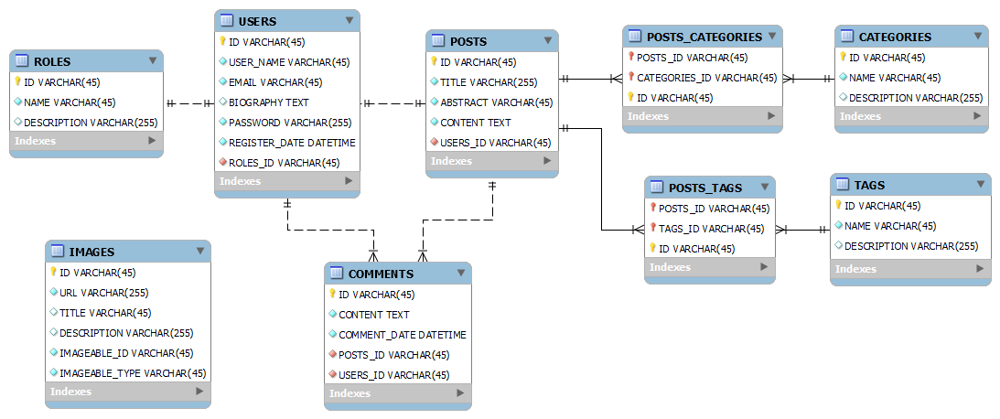

<p align="center"><a href="https://laravel.com" target="_blank"></a></p>

# Game Guru

A videogame blog app built in Laravel and just with Docker

## Software needed

Docker and docker-compose [Docker](https://www.docker.com)

Nodejs [Docker](https://nodejs.org/en)

## How to run the App

### Setup DEV environment

1. Install composer dependencies from a composer docker image in the root folder:
```bash
docker run --rm -v $(pwd):/app composer install
```

2. Once __vendor__ folder its filled copy de __.env__ file:
```bash
cp .env.example .env
```

3. Start docker-compose services:
```bash
./vendor/bin/sail up -d
```

4. Install node dependencies:
```bash
./vendor/bin/sail npm i

or 

npm i
```

5. Generate your app key with artisant: 
```bash
./vendor/bin/sail php artisan key:generate
```

6. Execute migrations:
```bash
./vendor/bin/sail php artisan migrate
```

7. Execute Seeders
```bash
./vendor/bin/sail php artisan db:seed --class=DBSeeder
```

8. Run Vite
```bash
./vendor/bin/sail npm run dev

or 

npm run dev
```

_Congratulation_ if everything goes well you can see the app running [here](http://localhost)

## Software needed

Database Design



## License

The Laravel framework is open-sourced software licensed under the [MIT license](https://opensource.org/licenses/MIT).
